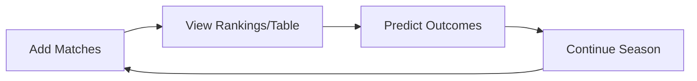

# Football Elo Rating System ⚽

A comprehensive Elo rating and championship prediction system for football leagues with round-robin format (home and away matches).


## 📋 Table of Contents

- [Overview](#overview)
- [Features](#features)
- [Installation](#installation)
- [Quick Start](#quick-start)
- [How It Works](#how-it-works)
- [Usage Guide](#usage-guide)
- [Understanding the Output](#understanding-the-output)
- [Data Management](#data-management)
- [Configuration](#configuration)
- [Contributing](#contributing)
- [License](#license)

## 🎯 Overview

This system calculates team strength using the Elo rating algorithm, optimized specifically for football. Unlike traditional league tables that only show current points, Elo ratings reveal the **true underlying strength** of each team by accounting for:

- Match difficulty (opponent strength)
- Home advantage
- Goal difference
- Early season uncertainty

The system also uses Monte Carlo simulation to predict final championship standings based on current form and remaining fixtures.

## ✨ Features

### Core Rating System
- **Adaptive K-Factor**: Higher sensitivity (K=50) for first 5 matches, then stabilizes (K=40)
- **Goal Difference Weighting**: Victory margins influence rating changes (1.0x to 1.75x multiplier)
- **Home Advantage**: 60 Elo points for home teams
- **Fast Convergence**: Reliable ratings after just 5 matches per team

### Match Management
- ✅ Complete match history with timestamps
- ✅ Undo last match
- ✅ Edit any historical match
- ✅ Delete matches with automatic recalculation
- ✅ Automatic backup on every change

### Championship Features
- 📊 **Live League Table**: Points, goals, and Elo ratings
- 🔮 **Season Prediction**: Monte Carlo simulation (100,000 iterations)
- 📈 **Match Predictions**: Win/Draw/Loss probabilities
- 🏆 **Championship Odds**: Title and top-5 finish probabilities

### Data Safety
- 💾 Automatic timestamped backups
- 🔄 Manual backup and restore
- 📝 Complete match history preservation
- 🔧 Team renaming across all records

## 🚀 Installation

### Requirements
- Python 3.6 or higher
- No external dependencies (uses Python standard library only)

### Setup

1. Clone the repository:
```bash
git clone https://github.com/christian-buti/football_elo.git
cd football_elo
```

2. Run the script:
```bash
python football_elo.py
```

That's it! No pip installs required.

## 🏁 Quick Start

### First Time Setup

1. **Start the program**:
```bash
python football_elo.py
```

2. **Add your first match** (Option 1):
```
Home team: Manchester United
Away team: Liverpool
Goals Manchester United: 2
Goals Liverpool: 1
Neutral venue? (y/n, default=n): n
```

3. **View rankings** (Option 2):
```
ELO RANKINGS
====================================================================
Rank   Team                      Rating     Matches  Status
--------------------------------------------------------------------
1      Manchester United         1529.3     1        Provisional
2      Liverpool                 1470.7     1        Provisional
```

### Basic Workflow


## 🔬 How It Works

### Elo Rating Formula

The system uses a modified Elo calculation optimized for football:
```
New Rating = Old Rating + K × (Actual Score - Expected Score)
```

Where:
- **K-Factor**: 50 (first 5 matches) → 40 (established)
- **K adjusted** by goal difference: ×1.0 to ×1.75
- **Expected Score**: Based on rating difference and home advantage

### Home Advantage

Home teams receive a +60 Elo boost for probability calculations:
```
Rating_effective = Rating_actual + 60
```

This reflects the statistical advantage of playing at home (familiar pitch, crowd support, no travel).

### Draw Probability

Draw likelihood decreases as rating gap increases:

| Rating Difference | Draw Probability |
|------------------|------------------|
| 0-100 points     | ~25-27%         |
| 100-200 points   | ~20-25%         |
| 200-300 points   | ~15-20%         |
| 300+ points      | ~8-15%          |

### Monte Carlo Simulation

For season predictions:

1. Takes current league standings (points)
2. Identifies all remaining fixtures (home/away pairs)
3. For each of 100,000 simulations:
   - Calculates match probabilities using Elo
   - Simulates realistic scorelines
   - Tracks final points and positions
4. Aggregates results into probability distributions

## 📖 Usage Guide

### Menu Options
```
1:  Add Match Result       - Record a completed match
2:  Elo Rankings          - View strength rankings
3:  League Table          - View points table
4:  Season Prediction     - Predict final standings
5:  Match History         - View past matches
6:  Undo Last Match       - Remove most recent entry
7:  Edit Match            - Correct a past match
8:  Delete Match          - Remove specific match
9:  Predict Match         - Get odds for upcoming match
10: Backup & Restore      - Manage data backups
11: Rename Team           - Change team name
12: Reset All Data        - Clear everything
13: Save and Exit         - Quit program
```

### Adding Matches

Always enter teams as **Home vs Away**:
```
Home team: Real Madrid
Away team: Barcelona
Goals Real Madrid: 3
Goals Barcelona: 1
Neutral venue? (y/n): n
```

The system automatically applies home advantage unless you specify neutral venue.

### Predicting a Match

Get probabilities for an upcoming fixture:
```
Home team: Chelsea
Away team: Arsenal
Neutral venue? (y/n): n

Chelsea (Elo: 1650.5, 12 matches)
vs
Arsenal (Elo: 1580.2, 12 matches)

Venue: Chelsea (Home)
Rating difference: 70.3 points

Predicted probabilities:
  Chelsea Win: 52.3%
  Draw:        24.1%
  Arsenal Win: 23.6%
```

### Season Prediction

View championship probabilities:
```
PREDICTED FINAL STANDINGS
Based on 100,000 Monte Carlo simulations
================================================================================
Team                   Curr  Pts  Pred  Title   Top 5   Final    Range
                       Pos   Now  Pos   %       %       Pts      (Min-Max)
--------------------------------------------------------------------------------
Manchester City        1     45   1.2   78.3    99.8    82.4     76-88
Liverpool              2     43   2.3   18.2    98.1    78.6     71-85
Arsenal                3     40   3.1   2.8     89.4    74.2     67-81
```

**Reading the table**:
- **Pred Pos**: Average final position across simulations
- **Title %**: Probability of finishing 1st
- **Top 5 %**: Probability of top-5 finish
- **Final Pts**: Expected points at season end
- **Range**: Best and worst case scenarios

## 📊 Understanding the Output

### Match Result
```
Match #15: Bayern 3 - 1 Dortmund (H)
Ratings: Bayern 1689.4 (+18.2) | Dortmund 1571.8 (-18.2)
Pre-match probabilities: Bayern 61.2% | Draw 22.4% | Dortmund 16.4%
```

- **(H)**: Home team indicator
- **Ratings**: New rating (change from previous)
- **Pre-match probabilities**: What the odds were before the match

### Elo Rankings
```
Rank   Team                      Rating     Matches  Status
--------------------------------------------------------------------
1      Bayern Munich             1689.4     15       Established
2      Borussia Dortmund         1571.8     14       Provisional
```

- **Provisional**: Fewer than 5 matches (rating still stabilizing)
- **Established**: 5+ matches (reliable rating)

### League Table

Shows traditional standings with Elo ratings:
```
Pos  Team                   MP   W   D   L   GF   GA   GD     Pts  Elo
---------------------------------------------------------------------------
1    Bayern Munich          15   11  3   1   38   12   +26    36   1689.4
2    Borussia Dortmund      14   10  2   2   32   15   +17    32   1571.8
```

## 💾 Data Management

### Automatic Backups

Backups are created automatically:
- After adding each match
- Before restoring from backup
- When exiting the program

Backups are stored in `backups/` with timestamps:
```
backups/
  ├── backup_20240115_143022.json
  ├── backup_20240115_151534.json
  └── backup_20240115_164411.json
```

### Manual Backup & Restore

**Option 10: Backup & Restore**

1. **Create manual backup**: Save current state
2. **List backups**: View all available restore points
3. **Restore**: Go back to any previous state

### Editing Historical Data

If you entered wrong data:

**Option 6**: Undo last match (fastest)
**Option 7**: Edit specific match by ID
**Option 8**: Delete specific match by ID

After any edit, **all ratings recalculate automatically** to maintain consistency.

## ⚙️ Configuration

Edit these constants at the top of the file to customize:
```python
INITIAL_RATING = 1500.0          # Starting rating for new teams
K_FACTOR_BASE = 40               # Base K-factor for established teams
K_FACTOR_EARLY = 50              # K-factor for first 5 matches
EARLY_MATCHES_THRESHOLD = 5      # Matches before "established" status
HOME_ADVANTAGE = 60.0            # Elo points for home field advantage

# Goal difference multipliers
GD_MULTIPLIERS = {
    1: 1.0,    # 1-goal margin
    2: 1.3,    # 2-goal margin
    3: 1.5,    # 3-goal margin
    4: 1.65,   # 4-goal margin
    5: 1.75    # 5+ goal margin (capped)
}
```

### Tuning for Your League

**Small amateur leagues** (current settings):
- Higher K-factors (40-50) for faster convergence
- Fewer matches needed for reliability

**Professional leagues**:
- Lower K-factors (20-30) for stability
- More matches before established status

**Different sports**:
- Adjust home advantage (basketball ~100, ice hockey ~75)
- Modify draw probability formula
- Change goal difference multipliers

## 📄 License

MIT License - see [LICENSE](LICENSE) file for details.

## 🙏 Acknowledgments

- Elo rating system developed by Arpad Elo for chess
- Adapted for football based on statistical research
- Monte Carlo simulation techniques from predictive analytics

## 📧 Contact

Questions or suggestions? Open an issue on GitHub!

---

**Built for analyzing team strength in football leagues worldwide** 🌍⚽
